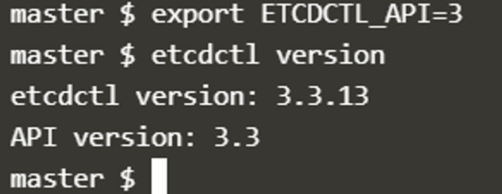

# Working with ETCDCTL
  - Take me [Tutorial](https://kodekloud.com/topic/working-with-etcdctl/)


`etcdctl` is a command line client for etcd.

In all our Kubernetes Hands-on labs, the ETCD key-value database is deployed as a static pod on the master. The version used is v3.

To make use of etcdctl for tasks such as back up and restore, make sure that you set the ETCDCTL_API to 3.

You can do this by exporting the variable ETCDCTL_API prior to using the etcdctl client. This can be done as follows:

`export ETCDCTL_API=3`

On the **Master Node**:



To see all the options for a specific sub-command, make use of the **-h or --help** flag.


For example, if you want to take a snapshot of etcd, use:

`etcdctl snapshot save -h` and keep a note of the mandatory global options.


Since our ETCD database is TLS-Enabled, the following options are mandatory:

`--cacert`                                                verify certificates of TLS-enabled secure servers using this CA bundle

`--cert`                                                    identify secure client using this TLS certificate file

`--endpoints=[127.0.0.1:2379]`          This is the default as ETCD is running on master node and exposed on localhost 2379.

`--key`                                                      identify secure client using this TLS key file

```
ETCDCTL_API=3 etcdctl --endpoints=https://127.0.0.1:2379 \
  --cacert=/etc/kubernetes/pki/etcd/ca.crt \
  --cert=/etc/kubernetes/pki/etcd/server.crt \
  --key=/etc/kubernetes/pki/etcd/server.key \
  snapshot save /opt/snapshot-pre-boot.db
```

Similarly use the help option for **snapshot restore** to see all available options for restoring the backup.

`etcdctl snapshot restore -h`

For a detailed explanation on how to make use of the etcdctl command line tool and work with the -h flags, check out the solution video for the Backup and Restore Lab.
